# Orbital OS

A lightweight, policy-free x86_64 operating system kernel built in Rust, demonstrating safe userspace-to-kernel communication through minimal syscalls.

**Status**: Phase 2 - Direct Task Execution Model (Working ✅)

## Quick Start

### Build
```bash
cargo bootimage
```

### Run in QEMU
```bash
cargo run
```

### Test the Kernel
```bash
# After kernel boots:
> spawn 1
Spawned task 1 with PID: 1

> spawn 2
Spawned task 2 with PID: 2

> ps
PID    Status
1      Ready
2      Ready

> run
Executing all ready processes...
[Task 1] Hello from test task 1
[Task 1] Exiting with code 0
[Task 2] Hello from test task 2
[Task 2] Performing some work...
[Task 2] Exiting with code 1
Executed 2 processes

> ps
PID    Status
1      Exited(0)
2      Exited(1)

>
```

## Currently Implemented ✅

### Core Kernel Features
- ✅ **x86_64 bare-metal execution** - VGA buffer + serial output
- ✅ **Memory management** - Paging, heap allocation with bump/fixed-size allocators
- ✅ **CPU initialization** - GDT, IDT with interrupt handlers (no double faults!)
- ✅ **Interrupt handling** - Timer, keyboard, exception handlers
- ✅ **Async executor** - Cooperative multitasking for terminal
- ✅ **Process management** - Process creation, status tracking, direct execution
- ✅ **TTY abstraction** - Output routing (kernel/serial/vga)

### Shell Commands
| Command | Status | Purpose |
|---------|--------|---------|
| `echo <message>` | ✅ | Print a message |
| `ping` | ✅ | Respond with pong |
| `spawn [N]` | ✅ | Create new task (N=1-4) |
| `run` | ✅ | Execute all ready tasks |
| `ps` | ✅ | List all processes with status |
| `help` | ✅ | Show available commands |
| `clear` | ✅ | Clear screen |

### Syscalls Implemented (6 total)
| # | Name | Status | Purpose |
|---|------|--------|---------|
| 0 | `sys_hello` | ✅ | Magic number validation test |
| 1 | `sys_log` | ✅ | Kernel logging with newline |
| 2 | `sys_write` | ✅ | UNIX-style write to fd (1=stdout, 2=stderr) |
| 3 | `sys_exit` | ✅ | Process termination |
| 4 | `sys_read` | ✅ | Read from stdin (fd=0 only) |
| 5 | `sys_task_create` | ✅ | Spawn new process/task |

### Task System
- ✅ **Direct execution model** - Tasks called as Rust functions (no context switching)
- ✅ **Ready state** - Tasks queued but waiting for execution
- ✅ **Exit codes** - Captured and stored for each task
- ✅ **Multiple tasks** - Can spawn and run multiple tasks sequentially

## Build Status

```
✅ Compiles cleanly (zero errors, zero warnings)
✅ Boot image created: 990 KB
✅ Kernel boots without panic
✅ All shell commands working
✅ No double faults
```

## Architecture

Orbital OS uses a **direct task execution** model with three main subsystems:

### System Architecture

```mermaid
graph TB
    User["👤 User Input"]
    Executor["⚡ Async Executor"]
    Shell["🐚 Shell"]
    
    Spawn["spawn<br/>Add Task"]
    Ps["ps<br/>List Tasks"]
    Run["run<br/>Execute"]
    
    Exec["Execute<br/>Direct Call"]
    ProcTable["📋 Process Table<br/>Vec&lt;Process&gt;"]
    
    User --> Executor
    User --> Shell
    
    Shell --> Spawn
    Shell --> Ps
    Shell --> Run
    
    Spawn --> ProcTable
    Ps --> ProcTable
    Run --> Exec
    Exec --> ProcTable
    
    style User fill:#e1f5ff
    style Executor fill:#fff3e0
    style Shell fill:#f3e5f5
    style ProcTable fill:#e8f5e9
    style Spawn fill:#fce4ec
    style Ps fill:#fce4ec
    style Run fill:#fce4ec
    style Exec fill:#fff9c4
```



### Command Flow


### Process Model


### Key Design Principles

**Direct Execution Model**:
- ✅ Safe: No inline assembly for context restoration
- ✅ Simple: Rust function calls, easy to understand
- ✅ Responsive: No CPU freezes
- ✅ Foundation: Ready to evolve to preemptive in Phase 3

**Why This Approach**:
- Previous complex context switching caused double faults
- Direct calls eliminate context restoration bugs
- Sequential execution is simpler to debug
- Perfect foundation for adding preemption later

## Documentation

**For detailed implementation info, see:**
- [PHASE2_FIXES_APPLIED.md](PHASE2_FIXES_APPLIED.md) - What was fixed and how
- [ALTERNATIVE_SOLUTION.md](ALTERNATIVE_SOLUTION.md) - Current direct execution model explained
- [CLEANUP_SUMMARY.md](CLEANUP_SUMMARY.md) - What was cleaned up
- [DOCUMENTATION_INDEX.md](DOCUMENTATION_INDEX.md) - Full doc navigation

## Limitations (By Design)

Currently, this is a **Phase 2 foundation** with intentional limitations:

- **No preemption**: Tasks run sequentially, not in parallel
- **No automatic execution**: Must use `run` command to execute tasks
- **No concurrency**: One task at a time (future: async/await support)
- **No IPC**: Inter-process communication not yet implemented (planned for Phase 4)
- **No memory isolation**: Single address space (planned for Phase 3)

These are **intentional choices** to keep the implementation simple and safe while establishing a working foundation.

## Future Phases

- **Phase 3**: Cooperative/preemptive multitasking with timer interrupts
- **Phase 4**: IPC and message passing between tasks
- **Phase 5**: Memory protection and process isolation
- **Phase 6**: Advanced features (networking, package system, security)

## Build Instructions

```bash
# Build the bootimage
cargo bootimage

# Run in QEMU
cargo run

# Just compile without running
cargo build

# Check code without building
cargo check
```

## Project Layout

```
kernel/                  # Kernel library (no_std bare-metal)
  ├── src/main.rs        # Entry point
  ├── src/lib.rs         # Public API
  ├── src/process.rs     # Task spawning & execution
  ├── src/shell.rs       # Command dispatcher
  ├── src/syscall.rs     # Syscall handlers
  └── ...

boot/                    # Bootloader
userspace/               # Userspace programs (std)
docs/                    # Architecture documentation
```

## Git History

Latest commits:
- Direct task execution implementation (working ✅)
- Removed double-fault causing context switching
- Cleaned up 25 obsolete documentation files
- All shell commands responsive and bug-free
